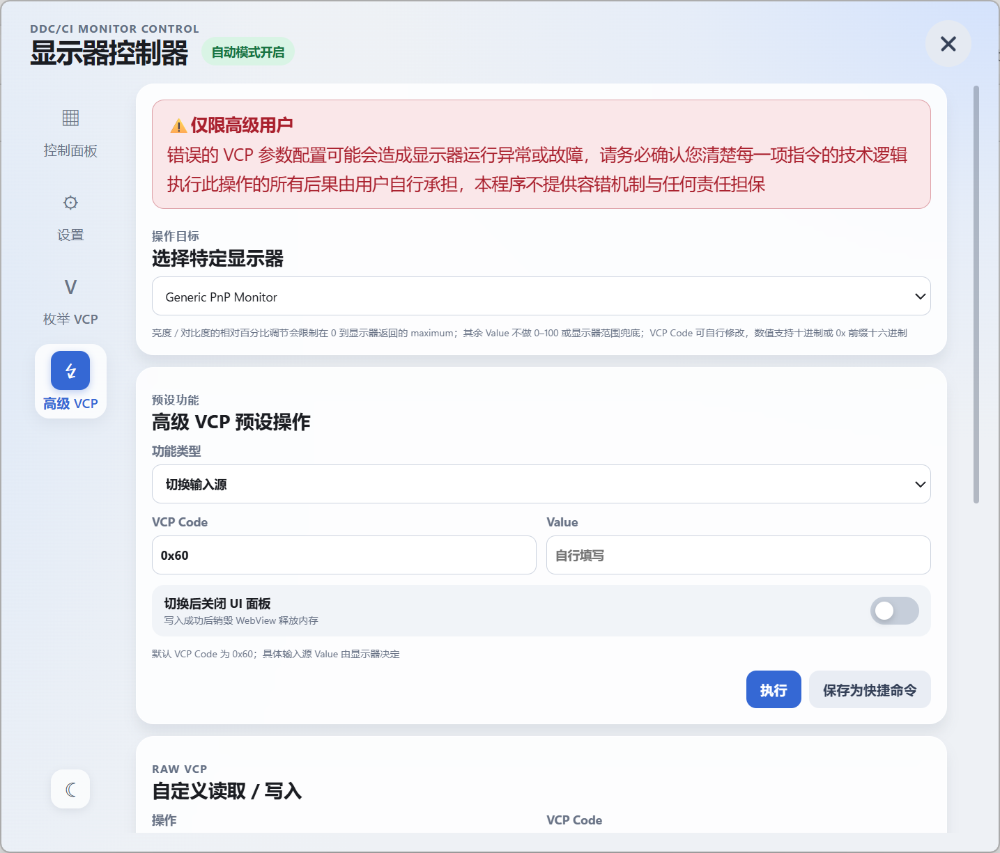

# DDC Monitor Controller

一款轻量级 Windows 显示器 DDC/CI 控制工具，提供图形化操作界面，支持手动/自动调节显示器亮度与对比度、枚举显示器 VCP Capabilities、高级 VCP 读写以及基于全局快捷键的快捷命令

GitHub: <https://github.com/DreamNya/DDC-Monitor-Controller>

## 功能特性

* 轻量级后台运行
  * 常驻内存约 **20 MB**
  * WebView UI 按需创建，关闭窗口后立即销毁
* 通过系统托盘快速唤醒操作界面
  * 提供 `快速设置` 和 `详细设置` 两种交互面板
* 支持多显示器控制
  * 可自由切换当前控制的显示器
  * 支持调节显示器亮度和对比度
  * 高级 VCP 快捷命令按显示器绑定，目标显示器离线时命令不可用
* 支持自动调节模式
  * 可自由添加和删除时间节点
  * 可为不同时间节点设置亮度和对比度
  * 支持创建多套自动设置方案并随时切换
  * 可配置自动模式运行间隔和目标显示器
* 支持 VCP Capabilities 枚举
  * 读取选中显示器的 DDC/CI Capabilities String
  * 自动解析 `vcp(...)` 中声明的 VCP Code 及离散支持值
  * 支持批量读取已枚举 VCP 的当前值
  * 提供格式化后的 Raw Capabilities 查看区域
* 支持高级 VCP 操作
  * 提供亮度/对比度相对百分比调节
  * 提供亮度/对比度绝对值写入
  * 支持切换输入源和电源模式
  * 支持自定义读取或写入任意 `0x00 ~ 0xFF` VCP Code
* 支持高级 VCP 快捷命令
  * 可将高级 VCP 操作保存为按显示器分组的快捷命令
  * 支持为快捷命令配置系统级全局快捷键
* 界面设置
  * 支持亮色 / 暗色主题
  * 支持分别调整快速设置与详细设置面板缩放比例
  * 支持调整默认文字大小

## 界面预览


<p align="center"><sub>▲ 快速设置界面</sub></p>

<br>


<p align="center"><sub>▲ 详细设置界面</sub></p>


<p align="center"><sub>▲ 详细设置-高级VCP界面</sub></p>

## TODO

* [ ] 自动配置开机启动或计划任务
* [ ] 自动获取日出、日落时间，并作为方案的初始和末尾时间节点
* [ ] 时间节点之间的非线性变化

## 运行环境

* Windows x64
* 显示器支持并已开启 DDC/CI
* Microsoft Edge WebView2 Runtime
* Node.js >= v24（可选，Portable Release 已附带 Node.js Runtime，无需单独安装）

> 不同品牌和型号的显示器对 DDC/CI / MCCS 的支持程度可能存在差异；部分显示器需要在 OSD 菜单中手动开启 DDC/CI

## 使用方法

### 下载

下载编译后的文件

* **GitHub Release**

```text
https://github.com/DreamNya/DDC-Monitor-Controller/releases
```

* **蓝奏云分流**

```text
https://wwbwh.lanzouw.com/b01d75e9of
密码:4zwx
```

### 版本说明

| 版本 | 是否包含 Node.js Runtime | 适用场景 |
| ---- | ---- | ---- |
| portable | 是 | 文件体积较大，无需额外安装 Node.js 运行时 |
| noRuntime | 否 | 文件体积较小，仅包含必要文件 |

> *不同版本仅影响解压后的文件体积，不影响实际内存占用
>
> **所有版本均不包含 WebView2 Runtime**，如果系统中不存在，建议安装 Microsoft Edge 或单独安装 WebView2 Runtime

### 启动

双击 `DDCMonitorController.exe` 即可启动程序

程序启动后会常驻系统托盘

（可将 `DDCMonitorController.exe` 添加到系统启动项或计划任务以支持开机自动启动）

### 快速设置

* 左键单击托盘图标，打开快速设置面板
* 拖动滑块，调节当前显示器的亮度和对比度
* 点击显示器名称，切换到其他显示器
* 可从快速设置面板进入详细设置

### 托盘菜单

右键单击托盘图标，可打开快捷菜单，并进入快速设置或详细设置

### 详细设置

详细设置面板通过侧边栏提供 `控制面板`、`设置`、`枚举 VCP`、`高级 VCP` 等功能

#### 控制面板

* 调节自动模式运行间隔
* 开启或关闭自动调节
* 创建、删除、重命名和切换自动设置方案
* 添加或删除时间节点
* 设置各时间节点的亮度和对比度
* 选择自动调节的目标显示器
* 拖动标题栏改变窗口位置
* 拖动窗口边缘改变窗口大小

> 目前时间节点暂不支持手动排序；保存方案后，程序会按照时间自动排序

#### 枚举 VCP

1. 选择需要检查的显示器
2. 点击 `枚举 VCP`，读取显示器 Capabilities
3. 程序会解析显示器声明支持的 VCP Code 和离散值，并显示在表格中
4. 点击 `读取 VCP`，批量读取当前已枚举 VCP 的当前值
5. 点击任意表格单元格可将内容复制到剪贴板
6. 展开 `Raw Capabilities` 可查看格式化后的原始 Capabilities String

> Capabilities 中声明某个 VCP Code，并不一定代表该 Code 可以通过标准 `Get VCP Feature` 正常读取；部分厂商私有 VCP 或固件实现不完整的功能可能返回“不支持”或其他 DDC/CI 错误

#### 高级 VCP

高级 VCP 面板允许先选择一台具体显示器，再执行以下操作：

* **预设功能**
  * 亮度 / 对比度增加或减少指定百分比
    * 默认 VCP Code：亮度 `0x10`、对比度 `0x12`
    * 百分比调节会根据显示器返回的 `maximum` 计算步长
    * 最终写入值限制在 `0 ~ maximum`
    * 即使当前值已经处于 `0` 或 `maximum`，再次执行仍会发送一次 VCP 写入
  * 亮度 / 对比度写入指定数值
  * 切换输入源（默认 VCP Code `0x60`）
  * 切换电源模式（默认 VCP Code `0xD6`）
  * 所有预设 VCP Code 均可由用户自行修改
* **RAW VCP**
  * 支持输入任意 VCP Code 进行读取
  * 支持输入任意 VCP Code 和 Value 进行写入
  * 除相对百分比调节外，程序不会根据显示器型号对用户填写的 Value 进行范围兜底或自动修正

##### 快捷命令与全局快捷键

高级 VCP 操作可以保存为快捷命令：

* 快捷命令绑定保存时选中的具体显示器
* 命令列表按显示器分组展示
* 目标显示器离线时，快捷命令不可执行
* 可为快捷命令配置可选的系统级全局快捷键
* 全局快捷键通过 Win32 `RegisterHotKey` 注册，因此 Control Panel / WebView 已关闭时仍然有效
* 本程序内部快捷键重复时，会提示占用该组合键的快捷命令
* 如果快捷键已被 Windows 或其他应用注册，系统只能返回“快捷键已被占用”，无法可靠获知具体外部占用程序

#### 设置

* 切换亮色 / 暗色主题
* 修改快速设置面板缩放比例
* 修改详细设置面板缩放比例
* 修改默认文字大小
* 查看或打开日志目录等程序设置

### 数据存储

**配置文件和 WebView 数据目录：**

```text
%LOCALAPPDATA%\DDCMonitorController
```

> 高级 VCP 快捷命令及其全局快捷键配置会随程序设置一并持久化保存

**日志文件：**

日志文件保存在程序所在目录 `log` 文件夹中

## 开发

### 技术栈

* Node.js
* TypeScript
* WebView2
* DDC/CI / MCCS
* Windows Native DLL / Node-API Addon

### 架构说明

本项目采用 **C++ Native 能力层 + TypeScript 业务层 + WebView2 Renderer UI** 的结构

#### 总体原则

* **C++ 负责 Windows / 硬件相关的底层能力**
  * 物理显示器枚举与 DDC/CI VCP 读写
  * Capabilities String 获取
  * WebView2 / Win32 窗口能力
  * 系统级全局快捷键注册
* **TypeScript 负责应用业务逻辑与状态管理**
  * 显示器状态缓存与自动调节
  * Capabilities / VCP 数据解析
  * 高级 VCP 命令与快捷命令管理
  * 前后端 RPC 和配置持久化
* **HTML / CSS / TypeScript Renderer 负责界面展示与用户交互**

> 各层通过明确的 Native Addon / WebMessage RPC 边界通信，避免业务逻辑与桥接逻辑耦合

#### 目录结构

```text
native/
├─ Launcher/         Windows 启动器
├─ WebViewNative/    WebView2 / Win32 / 全局快捷键桥接层
└─ MonitorNative/    DDC/CI VCP / Capabilities 桥接层

src/
├─ main/             Node.js 后端业务层
├─ renderer/         WebView2 前端 UI
└─ shared/           前后端共享类型、模型、VCP 工具与 RPC 契约
```

### 克隆项目

```bash
git clone https://github.com/DreamNya/ddc-monitor-controller.git
cd ddc-monitor-controller
```

### 安装依赖

```bash
npm install
```

### 类型/语法检查

```bash
tsc --noEmit
npx eslint .
```

### 编译 DDC/CI 原生模块

```bash
npm run build:native
```

### 开发模式

支持前端热重载

```bash
npm run dev
```

### 编译打包

**不包含 Node.js Runtime：**

```bash
npm run build
```

**包含 Node.js Runtime：**

```bash
npm run portable
```

## 许可证

本项目基于 [MIT License](LICENSE) 开源
