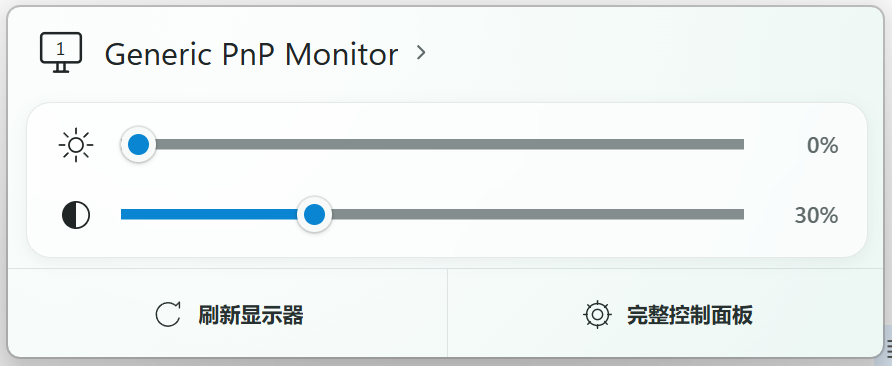
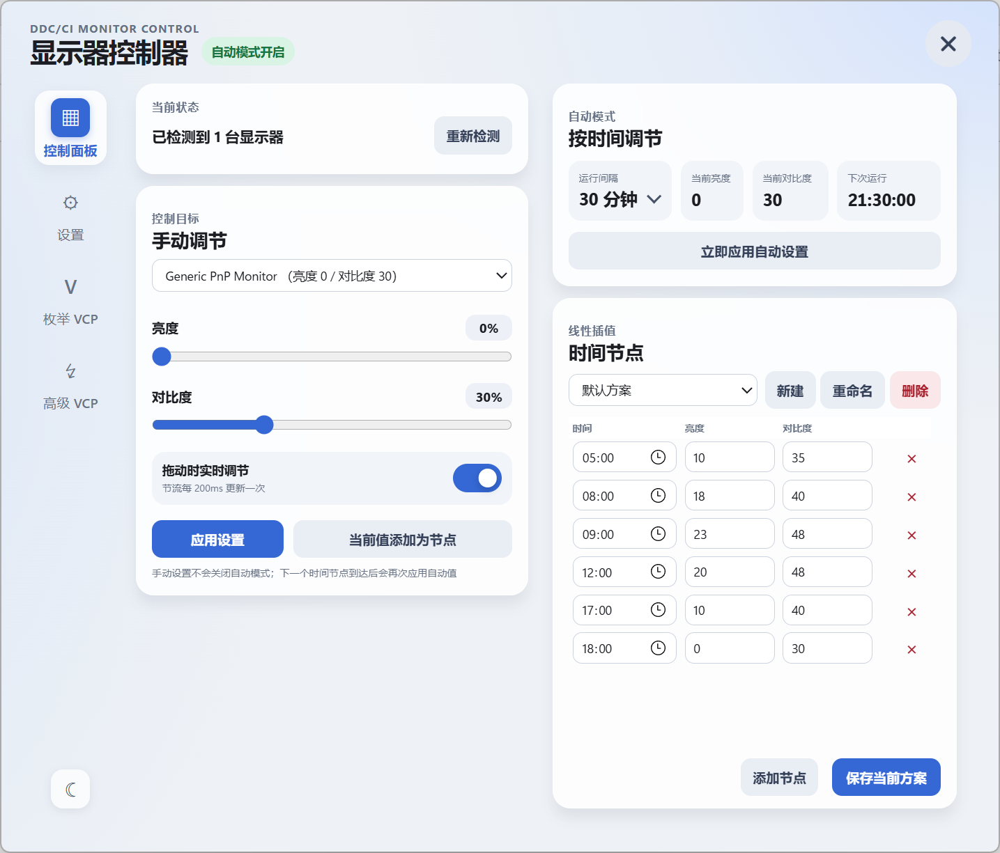

# DDC Monitor Controller

一款轻量级 Windows 显示器 DDC/CI 控制工具，提供图形化操作界面，支持手动和自动调节显示器亮度与对比度

GitHub: <https://github.com/DreamNya/DDC-Monitor-Controller>

## 功能特性

* 轻量级后台运行
  * 常驻内存约 **20–25 MB**
  * WebView UI 按需创建，关闭窗口后立即销毁
* 通过系统托盘快速唤醒操作界面
  * 提供 `快速设置` 和 `详细设置` 两种交互面板
* 支持多显示器控制
  * 可自由切换当前控制的显示器
  * 支持调节显示器亮度和对比度
* 支持自动调节模式
  * 可自由添加和删除时间节点
  * 可为不同时间节点设置亮度和对比度
  * 支持创建多套自动设置方案并随时切换

## 界面预览


<p align="center"><sub>▲ 快速设置界面</sub></p>

<br>


<p align="center"><sub>▲ 详细设置界面</sub></p>

## TODO

* [ ] 更多 DDC/CI 功能
* [ ] 自动配置开机启动或计划任务
* [ ] 自动获取日出、日落时间，并作为方案的初始和末尾时间节点
* [ ] 时间节点之间的非线性变化

## 运行环境

* Windows x64
* 显示器支持并已开启 DDC/CI
* Microsoft Edge WebView2 Runtime
* Node.js >= v24 （*可选，Portable Release 已附带 Node.js Runtime，无需单独安装）

> 不同品牌和型号的显示器对 DDC/CI 的支持程度可能存在差异。部分显示器需要在 OSD 菜单中手动开启 DDC/CI

## 使用方法

### 下载

下载编译后的文件

* **GitHub Release**

```text
https://github.com/DreamNya/DDC-Monitor-Controller/releases
```

* **蓝奏云分流**

```text
https://wwbwh.lanzouw.com/b01d75e9of
密码:4zwx
```

### 版本说明

| 版本 | 是否包含 Node.js Runtime | 适用场景
| ---- | ---- | ----
| portable | 是 | 文件体积较大，无需额外安装 Node.js 运行时
| noRuntime | 否 | 文件体积较小，仅包含必要文件

> *不同版本仅影响解压后的文件体积，不影响实际内存占用
>
> **所有版本均不包含 WebView2 Runtime，如果不存在建议安装 Microsoft Edge 或单独安装包

### 启动

双击 `DDCMonitorController.exe` 即可启动程序

程序启动后会常驻系统托盘

（可将`DDCMonitorController.exe`添加到系统启动项或计划任务以支持开机自动启动）

### 快速设置

* 左键单击托盘图标，打开快速设置面板
* 拖动滑块，调节当前显示器的亮度和对比度
* 点击显示器名称，切换到其他显示器
* 可从快速设置面板进入详细设置

### 托盘菜单

右键单击托盘图标，可打开快捷菜单，并进入快速设置或详细设置

### 详细设置

详细设置面板支持：

* 调节自动模式运行间隔
* 开启或关闭自动调节
* 创建、删除、重命名和切换自动设置方案
* 添加或删除时间节点
* 设置各时间节点的亮度和对比度
* 选择自动调节的目标显示器
* 拖动标题栏改变窗口位置
* 拖动窗口边缘改变窗口大小
* 修改快速设置面板、详细设置面板缩放比例

> 目前时间节点暂不支持手动排序。保存方案后，程序会按照时间自动排序

### 数据存储

**配置文件和 WebView 数据目录：**

```text
%LOCALAPPDATA%\DDCMonitorController
```

**日志文件：**

日志文件保存在程序所在目录`log`文件夹中

## 开发

### 技术栈

* Node.js
* TypeScript
* WebView2
* DDC/CI
* Windows Native DLL

### 架构说明

本项目采用 **C++ Native 能力层 + TypeScript 业务层 + WebView2 Renderer UI** 的结构

#### 总体原则

* **C++ 负责 Windows / 硬件相关的底层能力**
* **TypeScript 负责应用业务逻辑与状态管理**
* **HTML 负责界面展示与用户交互**
* 各层通过明确的 Native Addon / WebMessage RPC 边界通信，避免业务逻辑与桥接逻辑耦合

#### 目录结构

```text
native/
├─ Launcher/         Windows 启动器
├─ WebViewNative/    WebView2 / Win32 桥接层
└─ MonitorNative/    DDC/CI 桥接层

src/
├─ main/             Node.js 后端业务层
├─ renderer/         WebView2 前端 UI
└─ shared/           前后端共享类型、模型与 RPC 契约
```

### 克隆项目

```bash
git clone https://github.com/DreamNya/ddc-monitor-controller.git
cd ddc-monitor-controller
```

### 安装依赖

```bash
npm install
```

### 编译 DDC/CI 原生模块

```bash
npm run build:native
```

### 开发模式

支持前端热重载

```bash
npm run dev
```

### 编译打包

**不包含 Node.js Runtime：**

```bash
npm run build
```

**包含 Node.js Runtime：**

```bash
npm run portable
```

## 许可证

本项目基于 [MIT License](LICENSE) 开源
